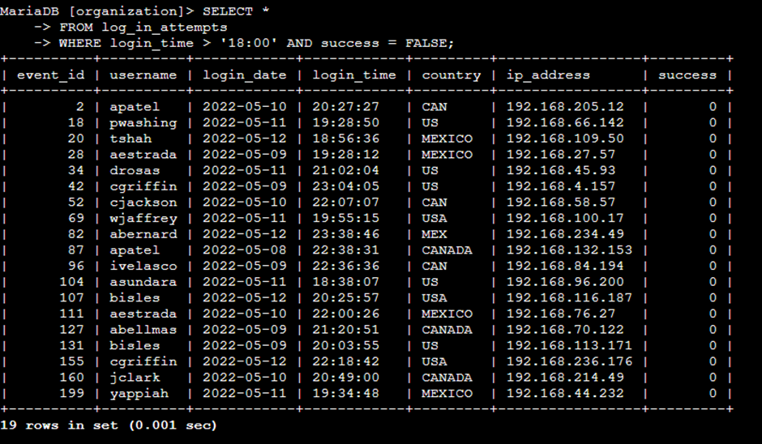
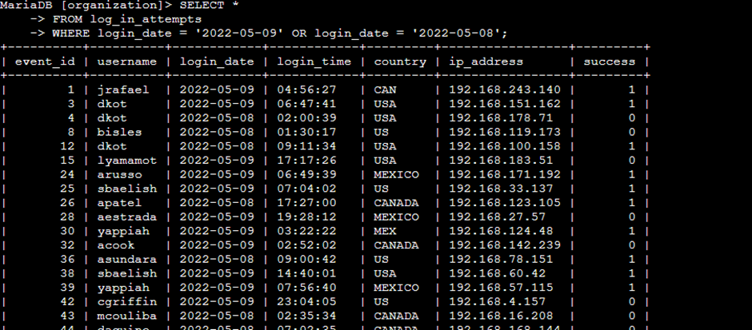
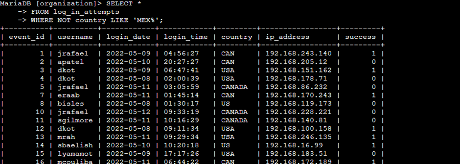
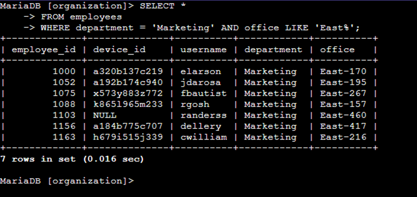
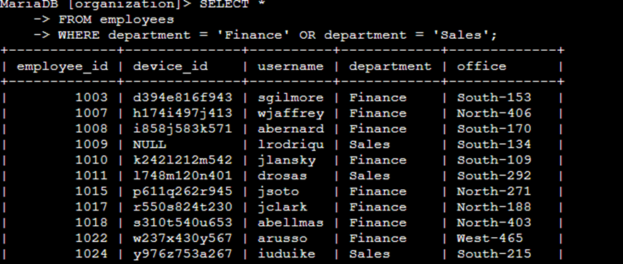
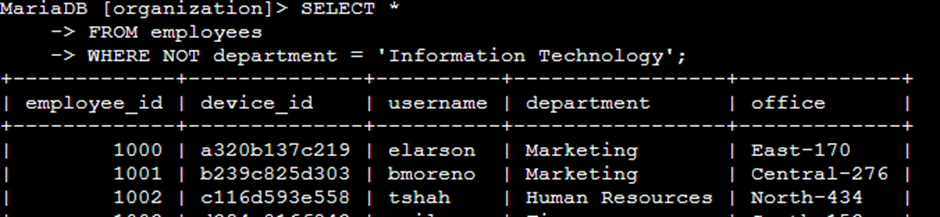

# Aplicar filtros a consultas SQL

**Descripción del proyecto:**
Este proyecto describe el fortalecimiento de la seguridad informática de la organización mediante la auditoría y actualización del sistema. El objetivo central es garantizar la integridad de la infraestructura, investigar posibles vulnerabilidades y gestionar la actualización de los equipos de los empleados. A continuación, se detallan diversos escenarios donde se aplicaron filtros mediante SQL para realizar tareas críticas de seguridad y gestión de activos.

## Recuperar intentos fallidos de inicio de sesión fuera del horario laboral

Tras detectarse un incidente de seguridad ocurrido después de la jornada laboral (18:00), se procedió a auditar todos los intentos de inicio de sesión fallidos registrados fuera del horario operativo estándar para identificar posibles accesos no autorizados.

La siguiente captura ilustra la sintaxis SQL diseñada para aislar exclusivamente los eventos de autenticación fallida que tuvieron lugar en el periodo nocturno.

La lógica de esta consulta se basa en la intersección de dos criterios específicos sobre la tabla log_in_attempts. Se empleó la cláusula WHERE junto con el operador lógico AND

para asegurar que solo se recuperen registros que cumplan ambas condiciones simultáneamente: primero, que el campo login_time > '18:00' (restringiendo el análisis al horario post-laboral) y, segundo, que el atributo success = FALSE (identificando errores de acceso).

## Recuperar intentos de inicio de sesión en fechas específicas

Debido a un evento sospechoso reportado el 2022-05-09, se requirió un análisis forense de los registros de acceso que abarcara tanto el día del incidente como el día previo, con el fin de detectar patrones anómalos previos al evento.

La captura de pantalla detalla la implementación de un filtro que permite consolidar los registros de múltiples fechas en una única vista de resultados.

En la imagen se visualiza la estructura de la consulta y el conjunto de datos resultante tras la ejecución.
Para esta extracción se utilizó el operador lógico OR, el cual es fundamental para ampliar el alcance de la búsqueda. Este operador permite recuperar cualquier registro que coincida con la fecha 2022-05-09 o con la fecha 2022-05-08. Al ser condiciones excluyentes en el tiempo pero requeridas en el reporte, el OR garantiza que los registros de ambos días se incluyan en el resultado final de la tabla log_in_attempts.

## Recuperar intentos de inicio de sesión fuera de México

El monitoreo global de seguridad reveló anomalías en las autenticaciones originadas fuera de México. Por lo tanto, fue necesario filtrar el tráfico internacional para un análisis detallado de riesgos geográficos.
A continuación, se muestra el comando SQL utilizado para excluir las conexiones locales y centrar el estudio en los accesos remotos.

Se puede observar la precisión de la consulta y la efectividad del filtro aplicado en el conjunto de resultados parcial.
La consulta utiliza el operador NOT en combinación con LIKE para negar una condición de patrón. Se definió el patrón 'MEX%', donde el comodín de porcentaje (%) actúa como un sustituto que representa cualquier secuencia de caracteres posteriores. Esto permite capturar variaciones de registro como "MEX" o "MEXICO" de forma eficiente. Al anteponer el NOT, el motor de la base de datos excluye cualquier registro que comience con dicho patrón, devolviendo únicamente intentos de inicio de sesión de otros países

## Recuperar empleados de Marketing

Como parte de un programa de mantenimiento preventivo, se requiere identificar los equipos asignados al departamento de Marketing ubicados específicamente en el edificio Este para proceder con su actualización técnica.

La siguiente sentencia SQL permite segmentar la base de datos de empleados bajo criterios de departamento y ubicación física.

Para obtener este subconjunto de datos de la tabla employees, es imperativo el uso del operador AND. Este operador es estrictamente necesario porque actúa como un filtro restrictivo que exige el cumplimiento obligatorio de ambas premisas: el empleado debe pertenecer a 'Marketing' y su oficina debe coincidir con el patrón 'East%'.Sin el uso de AND, el resultado incluiría empleados de marketing en otros edificios o empleados de otros departamentos en el edificio Este, lo cual invalidaría el objetivo de la actualización.

## Recuperar empleados de Finanzas o Ventas

Se ha planificado una actualización de seguridad específica para los departamentos de Finanzas y Ventas. Debido a la naturaleza de estas funciones, los parámetros de configuración difieren de otros departamentos, lo que exige una extracción precisa de esta nómina.

El código presentado a continuación ilustra cómo filtrar registros pertenecientes a múltiples categorías departamentales de forma simultánea.

En esta consulta se utiliza el operador OR debido a que el atributo de departamento es una propiedad única por registro; es decir, un mismo empleado no puede pertenecer a 'Finance' y 'Sales' al mismo tiempo. El uso de OR permite que la consulta sea inclusiva para ambos grupos, recuperando a cualquier trabajador que cumpla con cualquiera de los dos criterios dentro de la tabla employees

## Recuperar todos los empleados que no están en TI

Finalmente, se requiere una actualización general para todos los empleados, excluyendo al personal del departamento de TI, quienes gestionan sus propios protocolos de seguridad internos.

Se presenta la consulta SQL diseñada para aislar a todos los departamentos excepto el de Tecnología de la Información.

Para este requerimiento, se aplicó la cláusula WHERE en conjunto con el operador NOT. Esta función actúa como un supresor directo: el sistema evalúa el valor del campo departamento y, si coincide con 'Information Technology', el registro es inmediatamente descartado del resultado final. Esto garantiza que la lista obtenida de la tabla employees contenga exclusivamente al personal ajeno al área técnica.

# Resumen

A través de la aplicación estratégica de filtros SQL sobre las tablas log_in_attempts y employees, se logró una gestión precisa de la información de seguridad. El uso de operadores lógicos (AND, OR, NOT) y herramientas de comparación de patrones (LIKE, %) permitió segmentar los datos de acuerdo con necesidades operativas críticas, garantizando la eficiencia en los procesos de auditoría y actualización del sistema.

