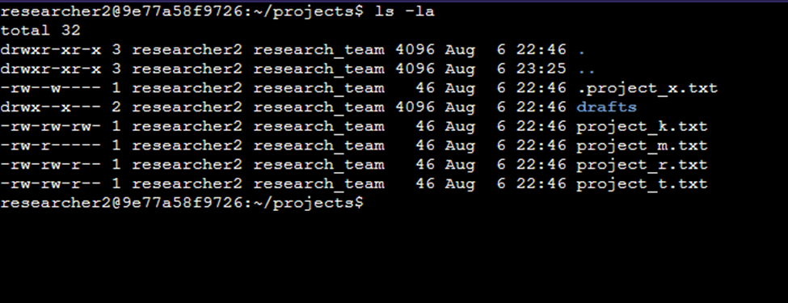
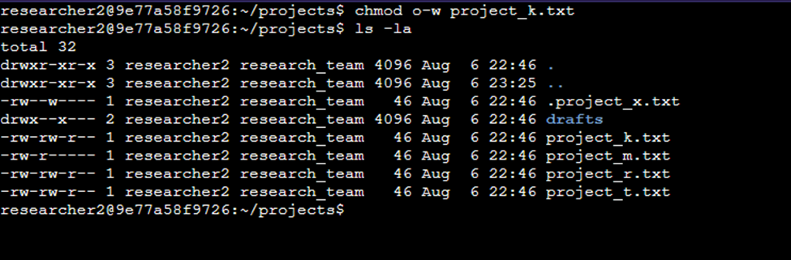
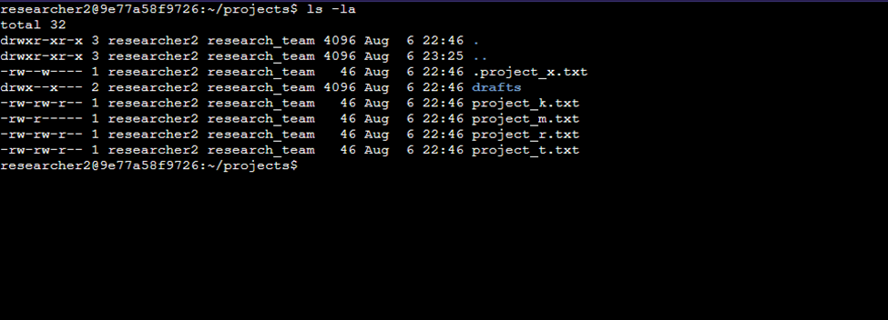
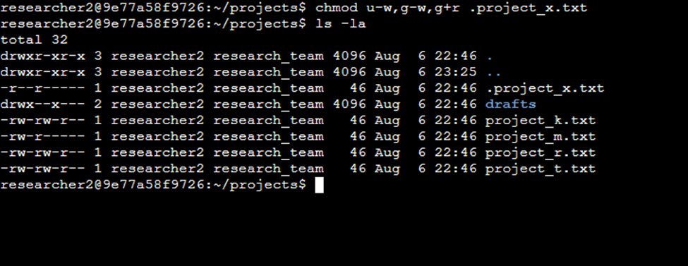
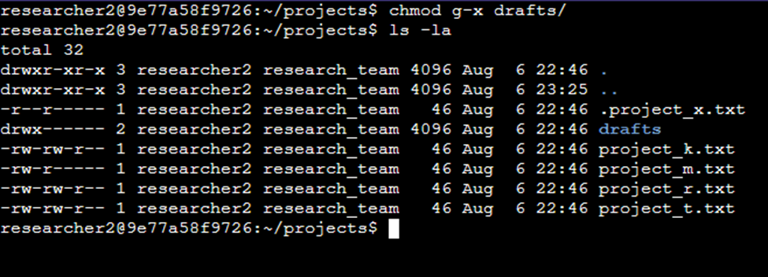

# Permisos de archivos en Linux

**Descripción del Proyecto:**
El equipo de investigación de mi organización necesita actualizar los permisos de ciertos archivos y directorios dentro del directorio de proyectos. Los permisos actuales no reflejan el nivel de autorización adecuado. Revisar y actualizar estos permisos contribuirá a mantener la seguridad del sistema. Para completar esta tarea, realicé las siguientes acciones:

## Consultar detalles de archivos y directorios

El siguiente código muestra cómo utilicé comandos de Linux para determinar los permisos existentes para un directorio específico en el sistema de archivos.

La primera línea de la captura de pantalla muestra el comando que ingresé, y las demás líneas muestran el resultado. El código enumera todo el contenido del directorio de proyectos. Utilicé el comando `ls` con la opción `-la` para mostrar un listado detallado del contenido de los archivos, incluyendo los ocultos. El resultado de mi comando indica que hay un directorio llamado `drafts`, un archivo oculto llamado `.project_x.txt` y otros cinco archivos de proyecto. La cadena de 10 caracteres en la primera columna representa los permisos establecidos para cada archivo o directorio.

## Describir la cadena de permisos

La cadena de 10 caracteres se puede descomponer para determinar quién está autorizado a acceder al archivo y sus permisos específicos. Los caracteres y lo que representan son los siguientes:

- **Primer carácter:** Este carácter puede ser una "d" o un guion (-) e indica el tipo de archivo. Si es una "d", se trata de un directorio. Si es un guion (-), se trata de un archivo normal.

- **Caracteres 2.º a 4.º:** Estos caracteres indican los permisos de lectura (r), escritura (w) y ejecución (x) del usuario. Si uno de estos caracteres es un guion (-), significa que el usuario no tiene dicho permiso.

- **Caracteres 5.º a 7.º:** Estos caracteres indican los permisos de lectura (r), escritura (w) y ejecución (x) para el grupo. Si uno de estos caracteres es un guion (-), significa que dicho permiso no está otorgado al grupo.

- **Caracteres 8.º a 10.º:** Estos caracteres indican los permisos de lectura (r), escritura (w) y ejecución (x) para otros usuarios. Este tipo de propietario incluye a todos los demás usuarios del sistema, excepto al usuario y al grupo. Si uno de estos caracteres es un guion (-), significa que este permiso no está otorgado para otros usuarios.

Por ejemplo, los permisos de archivo para project_t.txt son -rw-rw-r--. Dado que el primer carácter es un guion (-), esto indica que project_t.txt es un archivo, no un directorio. El segundo, quinto y octavo carácter son todos r, lo que indica que el usuario, el grupo y otros tienen permisos de lectura. El tercer y sexto carácter son w, lo que indica que solo el usuario y el grupo tienen permisos de escritura. Nadie tiene permisos de ejecución para project_t.txt.

## Cambiar permisos de archivos

La organización determinó que otros usuarios no deberían tener acceso de escritura a ninguno de sus archivos. Para cumplir con esto, consulté los permisos de archivo que había proporcionado previamente. Determinó que se debía eliminar el acceso de escritura para otros usuarios en project_k.txt.

El siguiente código muestra cómo utilicé comandos de Linux para realizar esta acción:

Las dos primeras líneas de la captura de pantalla muestran los comandos que ingresé, y las demás líneas muestran el resultado del segundo comando. El comando `chmod` cambia los permisos de archivos y directorios. El primer argumento indica qué permisos se deben cambiar, y el segundo argumento especifica el archivo o directorio. En este ejemplo, eliminé los permisos de escritura para el archivo `project_k.txt`. Después, usé `ls -la` para revisar los cambios realizados.

## Cambiar permisos de archivos en un archivo oculto

El equipo de investigación de mi organización archivó recientemente el archivo .project_x.txt. No quieren que nadie tenga acceso de escritura a este proyecto, pero el usuario y el grupo sí deben tener acceso de lectura.

A continuación, se describen los pasos realizados para modificar los permisos del archivo .project_x.txt. Se utilizó el comando 'ls -la' para listar los directorios y archivos, incluyendo los ocultos, junto con sus respectivos permisos.

En la siguiente captura se observa que las dos primeras líneas muestran los comandos ingresados, y las líneas restantes presentan el resultado del segundo comando. Utilicé el comando `chmod` para modificar los permisos del archivo oculto `.project_x.txt`, eliminando el acceso de escritura para otros usuarios y asegurando que el usuario y el grupo mantuvieran el acceso de lectura. Finalmente, ejecuté `ls -la` para verificar que los cambios se aplicaron correctamente.

## Cambiar permisos de directorio

La organización solicitó restringir el acceso al directorio de borradores. El objetivo fue asegurar que únicamente el usuario propietario tuviera permisos de ejecución para acceder al directorio, eliminando este permiso para el grupo y otros usuarios.

El siguiente código muestra cómo utilicé comandos de Linux para cambiar los permisos:

Las dos primeras líneas de la captura de pantalla muestran los comandos ejecutados, y las siguientes presentan el resultado de la verificación. Tras determinar que el grupo tenía permisos de ejecución innecesarios, utilicé el comando `chmod` para eliminarlos del directorio. Se verificó que el usuario `researcher2` ya contaba con los permisos adecuados, por lo que no se requirieron ajustes adicionales en su caso.

## Resumen
Modifiqué varios permisos para que coincidieran con el nivel de autorización que mi organización requería para los archivos y directorios en el directorio de proyectos. El primer paso fue usar `ls -la` para verificar los permisos del directorio. Esto me sirvió de base para las decisiones que tomé en los siguientes pasos. Luego, utilicé el comando `chmod` varias veces para cambiar los permisos de los archivos y directorios.

