# 📝 HackTheBox Write-up: Cap

## 📌 1. Información General
* **Plataforma:** HackTheBox
* **Máquina:** Cap
* **Dificultad:** Fácil
* **Sistema Operativo:** Linux
* **Enfoque:** Análisis de tráfico (PCAP), IDOR y Escalada de Privilegios vía Capabilities.

---

## 💡 2. Resumen Ejecutivo

>*La máquina se vio comprometida al explotar una vulnerabilidad IDOR en la aplicación web, lo que permitió descargar un archivo PCAP y analizar con Wireshark y obtener credenciales atreves del trafico del portocolo FTP. El acceso inicial se logró por SSH reutilizando dichas credenciales. La escalada a root se consiguió explotando capacidades (capabilities) mal configuradas en el binario de Python*.

---

## 🔍 3. Fase de Reconocimiento (Reconnaissance)

### Escaneo de Puertos
Se realizó un escaneo inicial utilizando Nmap para descubrir los servicios activos en la máquina víctima.

```bash
nmap -sC -sV -p- -T4 [TU_IP_OBJETIVO]
```

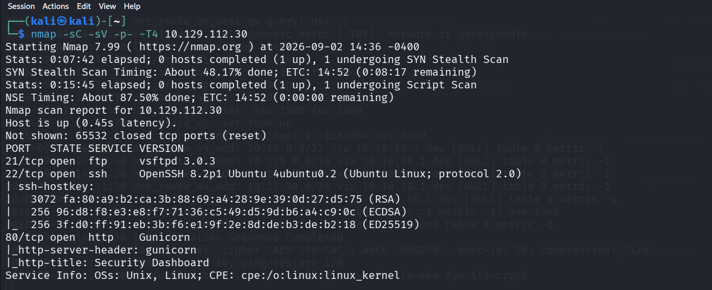

> *En la captura de la imagen se logra ver que los puertos abiertos son 21(ftp), 22 (ssh) y 80 (http)*

### Hallazgos Secundarios

Hallazgo 1: Uso de software desactualizado (OpenSSH)

 - **Severidad:** Media
 - Descripción: Durante la fase de reconocimiento se detectó que el puerto 22 ejecuta `OpenSSH 8.2p1-4ubuntu0.2`. Esta versión se encuentra obsoleta y es vulnerable a ataques de ejecución remota de código recientes, como CVE-2024-6387 (RegreSSHion)
 - **Nota del ejercicio:** Aunque esta vulnerabilidad representa un riesgo crítico, no fue explotada durante esta auditoría, ya que el compromiso del sistema se logró por otras vías.
 - **Recomendación:** Actualizar el paquete OpenSSH a la última versión estable provista por los repositorios de Ubuntu.

Hallazgo 2: Servicio FTP expuesto

- **Severidad:** Informativa
- **Descripción:** El servidor ejecuta `vsftpd 3.0.3` en el puerto 21. Si bien esta versión es relativamente estable, se encuentra documentada bajo el CVE-2021-30047, el cual permite potenciales ataques de Denegación de Servicio (DoS) por agotamiento de conexiones. Adicionalmente, el uso de FTP transmite información en texto claro si no está forzado el uso de TLS.
- **Recomendación:** Implementar reglas de firewall o `fail2ban` para limitar las conexiones recurrentes, y evaluar la transición a protocolos seguros como SFTP.

### Enumeración Web

Al explorar el puerto 80, se identificó un servidor web **Gunicorn** alojando una aplicación con interfaz de **Security Dashboard**.

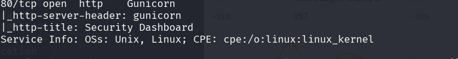

La funcionalidad principal de esta plataforma permite a los usuarios realizar, almacenar y analizar capturas de tráfico de red (archivos `.pcap`).

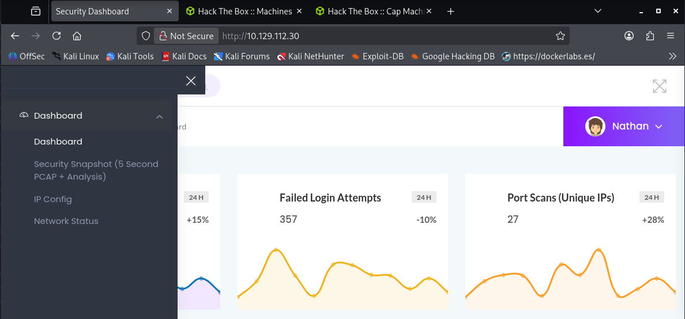


## 🚪 4. Acceso Inicial (Initial Foothold)

### Descubrimiento de IDOR

Al analizar las URLs de la aplicación web, se detectó una vulnerabilidad de tipo IDOR (Insecure Direct Object Reference) en el endpoint `/data`

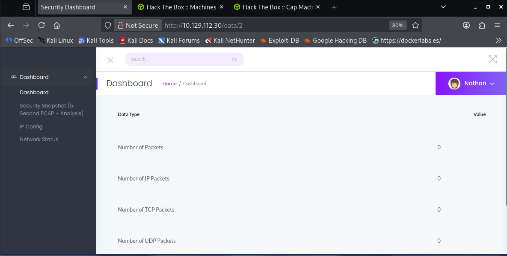

la cual permite acceder a recursos de otros usuarios manipulando el identificador en la URL. En este caso, se modificó la ruta `/data/2`, cambiando su identificador por `/data/1`.

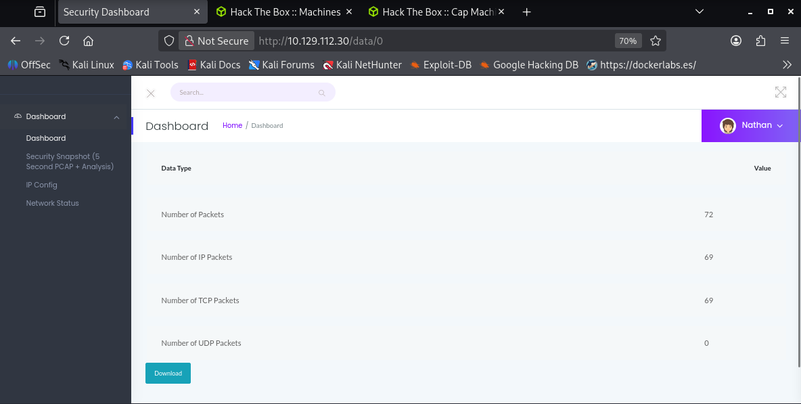


### Análisis de Tráfico (PCAP)

Gracias al IDOR, se logró descargar un archivo `.pcap`. Al abrirlo con Wireshark, se analizó el tráfico no cifrado.

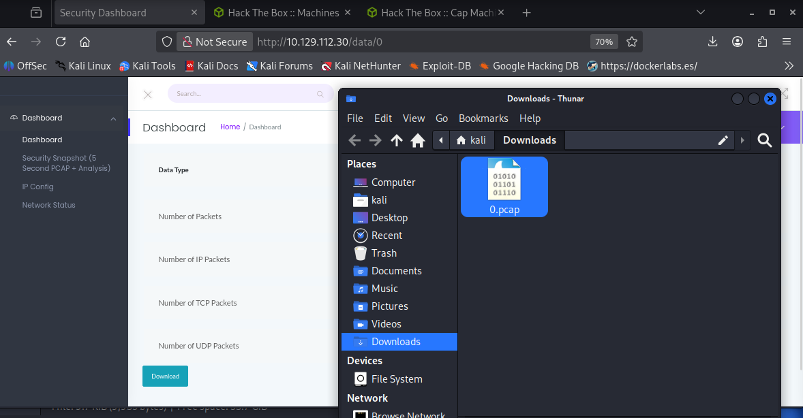


Con el objetivo de identificar información sensible transmitida en texto claro, se aplicó un filtro de visualización para aislar protocolos que no utilizan cifrado por defecto, como FTP o HTTP:

```plaintext
ftp or http
```

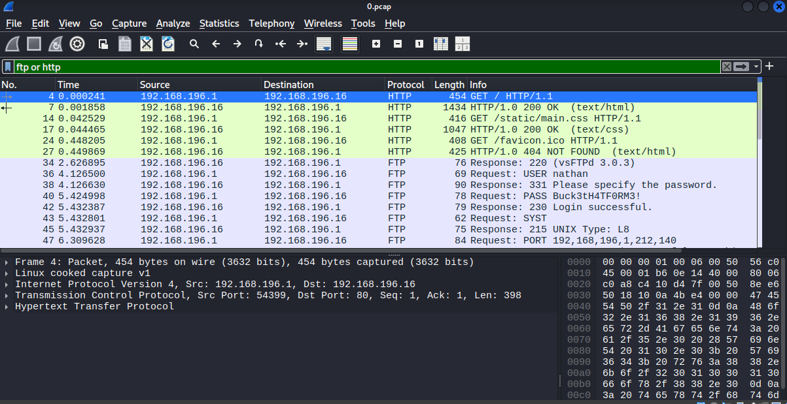


Como resultado de este filtrado, se observó tráfico perteneciente al protocolo FTP. Al inspeccionar el flujo de estos paquetes, se lograron extraer credenciales de autenticación transmitidas en texto claro (usuario y contraseña).

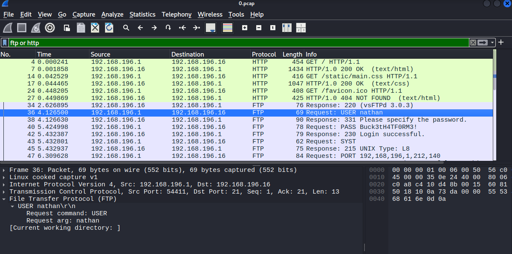


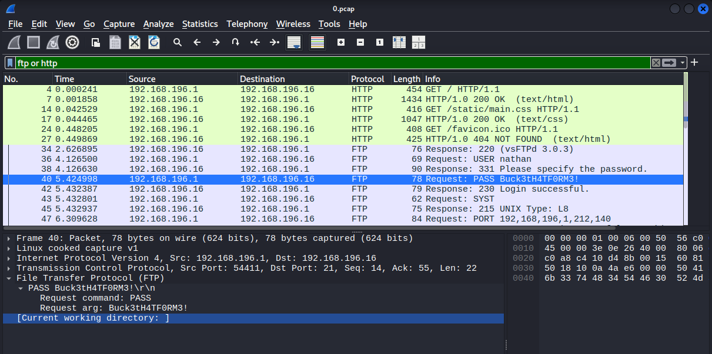

### Explotación (Reutilización de Contraseñas)

Se probó la contraseña descubierta directamente en el servicio SSH, logrando el acceso inicial como el usuario `nathan`.

``` bash
ssh nathan@[TU_IP_OBJETIVO]
```

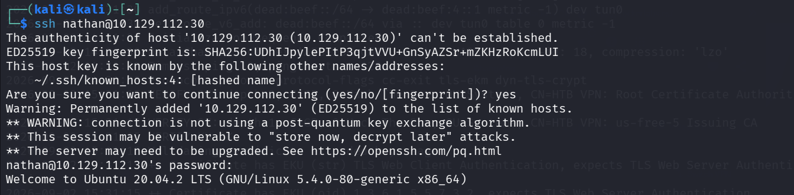

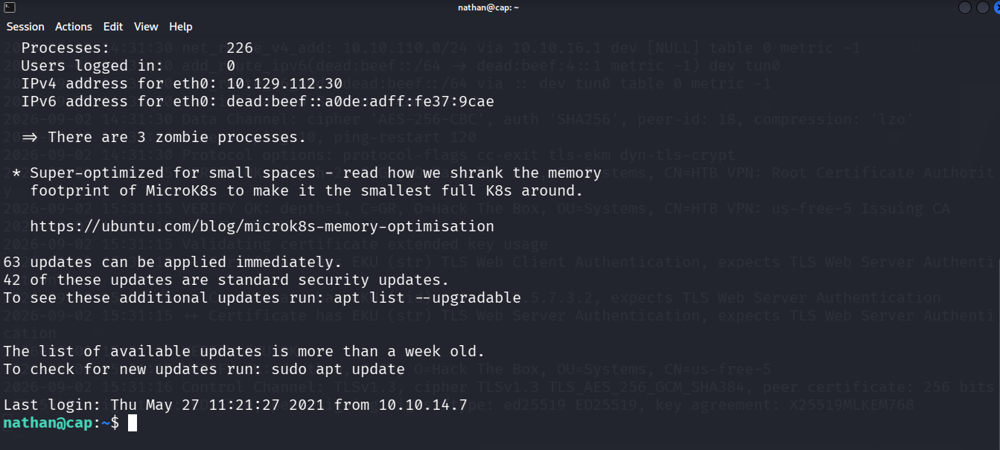


## 👑 5. Escalada de Privilegios (Privilege Escalation)

### Búsqueda de Capabilities

Tras obtener acceso inicial al sistema, se inició la fase de enumeración local para identificar vías de escalada de privilegios. Se realizó una búsqueda de binarios que poseyeran _Linux Capabilities_ (capacidades) asignadas de forma insegura, ejecutando el siguiente comando:

```bash
getcap -r / 2>/dev/null
```

El resultado de este comando reveló que el intérprete de Python (`/usr/bin/python3.8`) contaba con la capacidad `cap_setuid+ep`. Esto indica que el binario tiene permisos excepcionales para modificar su Identificador de Usuario (UID) a nivel de sistema.

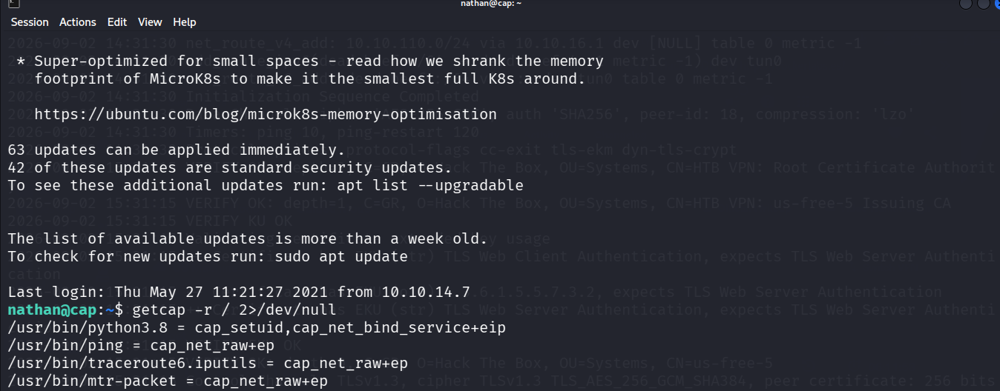


**Explotación (Abuso de cap_setuid)**

Aprovechando esta configuración insegura, se procedió a explotar el binario de Python. Se ejecutó un comando de una sola línea (_one-liner_) que importa el módulo `os`, fuerza el cambio del UID a `0` (el correspondiente al usuario `root`) y posteriormente invoca una shell de Bash:

```bash
/usr/bin/python3.8 -c 'import os; os.setuid(0); os.system("/bin/bash")'
```

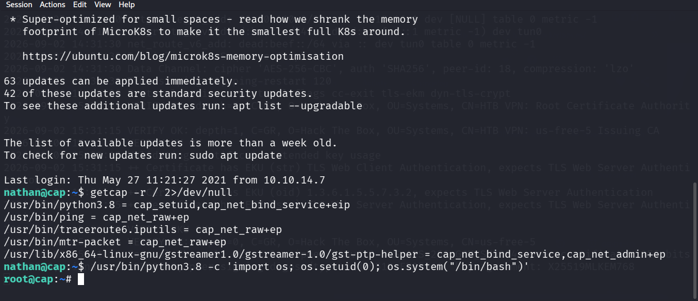

### Resumen del Compromiso

*El compromiso del sistema se originó por una vulnerabilidad IDOR en la aplicación web, que permitió el acceso a recursos sensibles sin validar la autorización del usuario. A través de este fallo, se obtuvo una captura de red que evidenció la transmisión  de credenciales en texto plano (FTP).La reutilización de estas credenciales facilito el acceso vía SSH.Finalmente la escalada de privilegios de administrador (`root`) se logró explotando una mala práctica a nivel de sistema: la asignación excesiva de _capabilities_ (`cap_setuid`) al intérprete de Python.*


### Impacto en el Negocio

*El compromiso de este servidor representa un riesgo crítico para la organización. La vulnerabilidad de IDOR podría ser utilizada por un atacante para acceder a información sensible de otros usuarios de manera no autorizada. Además, el uso de protocolos no cifrados como FTP expone los datos en tránsito, haciéndolos vulnerables a técnicas de _packet sniffing_.*

*La combinación de estas vulnerabilidades con la mala práctica de reutilizar credenciales facilitó el acceso inicial (SSH), lo cual, sumado a la escalada de privilegios, le otorgó al atacante acceso `root`. Este nivel de control abre un abanico de posibilidades críticas para un agente de amenazas, permitiendo ataques como la exfiltración de datos, el despliegue de _ransomware_ o la utilización de la información robada para ejecutar campañas de _spear phishing_ contra usuarios específicos. En conjunto, estos escenarios generarían un impacto financiero, reputacional y legal severo para el negocio.*


## 🛡️ 6. Perspectiva Blue Team (Remediación)

Para mitigar las vulnerabilidades explotadas en esta máquina, se recomiendan las siguientes acciones:

- **IDOR en la aplicación web:** Implementar controles de acceso estrictos a nivel de objeto en el _backend_. El servidor debe validar en cada petición que el identificador de sesión actual (mediante _tokens_ o _cookies_ seguras) posea los privilegios necesarios y sea el propietario legítimo del recurso solicitado en el endpoint `/data/`

- **Tráfico en texto plano:** Deshabilitar inmediatamente el servicio FTP, ya que transmite información en texto plano, y reemplazarlo por protocolos seguros como SFTP o SCP. Adicionalmente, se debe implementar una política de contraseñas que prohíba su reutilización en múltiples servicios.

- **Capabilities inseguras:** Revocar la capacidad `cap_setuid` asignada al intérprete de Python ejecutando el comando `setcap -r cap_setuid /usr/bin/python3.8`. Las _Linux capabilities_ deben auditarse regularmente y restringirse únicamente a binarios que requieran de forma legítima privilegios elevados para su funcionamiento


